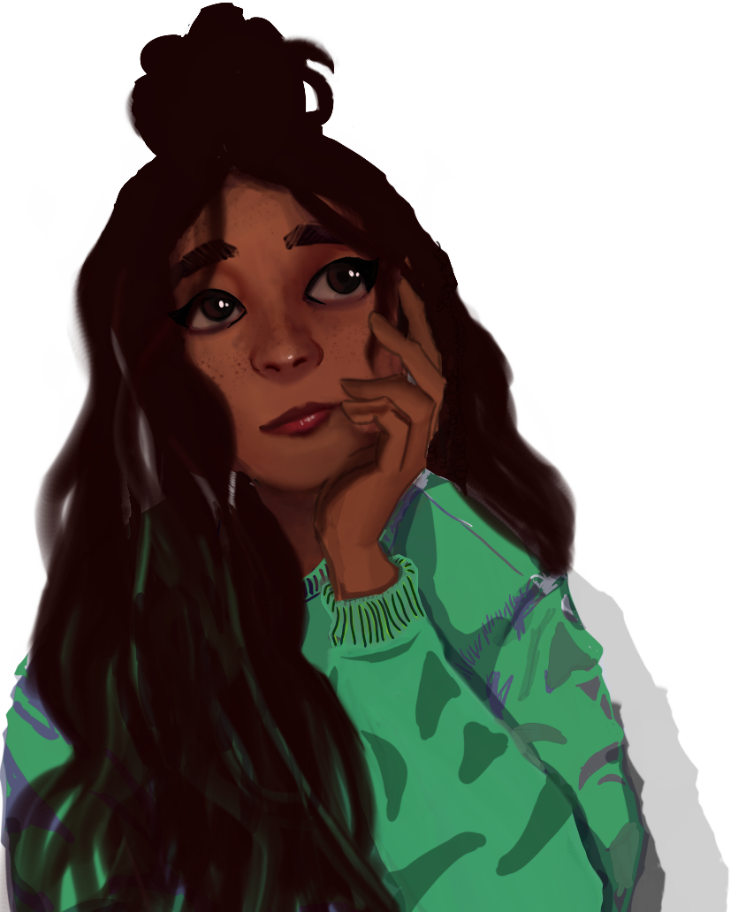
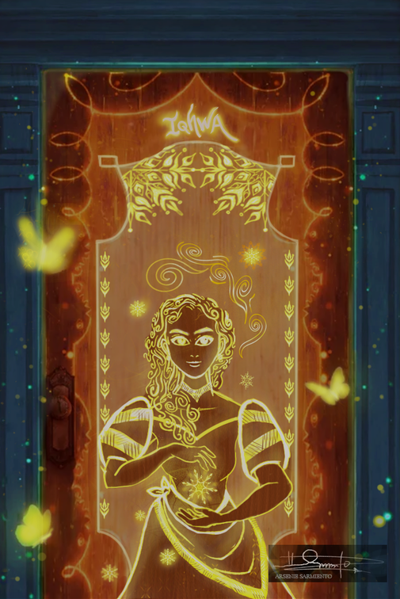

<!DOCTYPE html>
<html lang="en">
<head>
    <meta charset="UTF-8">
    <meta name="viewport" content="width=device-width, initial-scale=1.0">
    <title>Arsenie S.</title>
    <!-- BOOTSTRAP -->
    <link href="https://cdn.jsdelivr.net/npm/bootstrap@5.3.3/dist/css/bootstrap.min.css" rel="stylesheet">
    
    <link rel="stylesheet" href="https://cdnjs.cloudflare.com/ajax/libs/font-awesome/4.7.0/css/font-awesome.min.css">
    <!-- CUSTOM CSS -->
    <link rel="stylesheet" href="css/mouse_animation.css">
    <!-- <link rel="stylesheet" href="css/main_stylesheet.css"> -->
    <link href="/css/head.css" rel="stylesheet">
    <link href="/css/main.css" rel="stylesheet">
    <link href="/css/nav.css" rel="stylesheet">
    <!-- WEB FONT -->
    <link href="https://fonts.googleapis.com/css2?family=Albert+Sans:ital,wght@0,100..900;1,100..900&display=swap" rel="stylesheet">
    <!-- <link href="https://fonts.googleapis.com/css2?family=Albert+Sans:ital,wght@0,100..900;1,100..900&display=swap" rel="stylesheet"> -->
</head>
<body>
    <nav class="navbar d-flex justify-content-center">
        <ul class="navbar-nav">
            <!-- HOVER EXPAND -->
            <li class="nav-item nav-link-logo"><a href="#scrollSpy-head" class="link-logo">
                
                    
                     <!-- 
Arsenie
 -->
                    <!--  -->
                
            </a></li>       
            <!-- APPS & WEBSITES -->
            <li class="nav-item"><a href="#scrollSpy-development" class="nav-link">
                
                    <svg 
                        xmlns="http://www.w3.org/2000/svg"
                        viewBox="0 0 512 512"
                        class="svg-inline--fa fa-solid fa-palette fa-w-16 fa-2x">
                    >
                    <g class="fa-group"></g>
                    <path
                        fill="currentColor"
                        d="M156.6 384.9L125.7 354c-8.5-8.5-11.5-20.8-7.7-32.2c3-8.9 7-20.5 11.8-33.8L24 288c-8.6 0-16.6-4.6-20.9-12.1s-4.2-16.7 .2-24.1l52.5-88.5c13-21.9 36.5-35.3 61.9-35.3l82.3 0c2.4-4 4.8-7.7 7.2-11.3C289.1-4.1 411.1-8.1 483.9 5.3c11.6 2.1 20.6 11.2 22.8 22.8c13.4 72.9 9.3 194.8-111.4 276.7c-3.5 2.4-7.3 4.8-11.3 7.2l0 82.3c0 25.4-13.4 49-35.3 61.9l-88.5 52.5c-7.4 4.4-16.6 4.5-24.1 .2s-12.1-12.2-12.1-20.9l0-107.2c-14.1 4.9-26.4 8.9-35.7 11.9c-11.2 3.6-23.4 .5-31.8-7.8zM384 168a40 40 0 1 0 0-80 40 40 0 1 0 0 80z"
                        class="fa-primary">
                    </path></svg>
                Projects
            </a></li>
            <!-- WIP -->
            <li class="nav-item"><a href="#scrollSpy-wip" class="nav-link">
                
                    <svg 
                        xmlns="http://www.w3.org/2000/svg"
                        viewBox="0 0 512 512"
                        class="svg-inline--fa fa-solid fa-palette fa-w-16 fa-2x">
                    <g class="fa-group"></g>
                    <path
                        fill="currentColor"
                        d="M240.8 4.8C250.3 10.6 256 20.9 256 32l0 72 89 0c3.6-13.8 16.1-24 31-24l88 0c26.5 0 48 21.5 48 48s-21.5 48-48 48l-88 0c-14.9 0-27.4-10.2-31-24l-89 0 0 72c0 11.1-5.7 21.4-15.2 27.2s-21.2 6.4-31.1 1.4l-192-96C6.8 151.2 0 140.1 0 128s6.8-23.2 17.7-28.6l192-96c9.9-5 21.7-4.4 31.1 1.4zM288 256c0-17.7 14.3-32 32-32l160 0c17.7 0 32 14.3 32 32l0 64c0 17.7-14.3 32-32 32l-160 0c-17.7 0-32-14.3-32-32l0-64zM32 384l96 0c17.7 0 32 14.3 32 32l0 64c0 17.7-14.3 32-32 32l-96 0c-17.7 0-32-14.3-32-32l0-64c0-17.7 14.3-32 32-32zm192 0l256 0c17.7 0 32 14.3 32 32l0 64c0 17.7-14.3 32-32 32l-256 0c-17.7 0-32-14.3-32-32l0-64c0-17.7 14.3-32 32-32z"
                        class="fa-primary"></path>
                    </svg>
                Work-In-Progress
            </a></li>
            <!-- ARTWORKS -->
            <li class="nav-item"><a href="#scrollSpy-arts" class="nav-link">
                
                    <svg 
                        xmlns="http://www.w3.org/2000/svg"
                        viewBox="0 0 512 512"
                        class="svg-inline--fa fa-solid fa-palette fa-w-16 fa-2x">
                    <g class="fa-group"></g>
                    <path
                        fill="currentColor"
                        d="M512 256c0 .9 0 1.8 0 2.7c-.4 36.5-33.6 61.3-70.1 61.3L344 320c-26.5 0-48 21.5-48 48c0 3.4 .4 6.7 1 9.9c2.1 10.2 6.5 20 10.8 29.9c6.1 13.8 12.1 27.5 12.1 42c0 31.8-21.6 60.7-53.4 62c-3.5 .1-7 .2-10.6 .2C114.6 512 0 397.4 0 256S114.6 0 256 0S512 114.6 512 256zM128 288a32 32 0 1 0 -64 0 32 32 0 1 0 64 0zm0-96a32 32 0 1 0 0-64 32 32 0 1 0 0 64zM288 96a32 32 0 1 0 -64 0 32 32 0 1 0 64 0zm96 96a32 32 0 1 0 0-64 32 32 0 1 0 0 64z"
                        class="fa-primary"></path>
                    </svg>
                    Artworks
            </a></li>    
            <li class="nav-item"><a href="#scrollSpy-about" class="nav-link">
                
                    <svg 
                        xmlns="http://www.w3.org/2000/svg"
                        viewBox="0 0 610 610"
                        class="svg-inline--fa fa-solid fa-palette fa-w-16 fa-2x">
                    <g class="fa-group"></g>
                    <path
                        fill="currentColor"
                        d="M64 32C28.7 32 0 60.7 0 96L0 416c0 35.3 28.7 64 64 64l448 0c35.3 0 64-28.7 64-64l0-320c0-35.3-28.7-64-64-64L64 32zm80 256l64 0c44.2 0 80 35.8 80 80c0 8.8-7.2 16-16 16L80 384c-8.8 0-16-7.2-16-16c0-44.2 35.8-80 80-80zm-32-96a64 64 0 1 1 128 0 64 64 0 1 1 -128 0zm256-32l128 0c8.8 0 16 7.2 16 16s-7.2 16-16 16l-128 0c-8.8 0-16-7.2-16-16s7.2-16 16-16zm0 64l128 0c8.8 0 16 7.2 16 16s-7.2 16-16 16l-128 0c-8.8 0-16-7.2-16-16s7.2-16 16-16zm0 64l128 0c8.8 0 16 7.2 16 16s-7.2 16-16 16l-128 0c-8.8 0-16-7.2-16-16s7.2-16 16-16z"
                        class="fa-primary"></path>
                    </svg>
                    About Me
            </a></li>
        </ul>
    </nav>
    

        <header class="row d-flex justify-content-center align-middle" id="scrollSpy-head">
            <!-- 
 -->
            
            <!-- 
 -->
            

                <h4 class="text-center">Hi, I'm</h4>
                <h1 class="text-center">Arsenie</h1>
            

        </header>
        <aside>
            

                

                <a href="#scrollSpy-development">View works</a>
            <!-- 

                <a href="projects.html">Get to know through my <strong>works</strong>!</a>
            
 -->
            <!-- https://codepen.io/2xsamurai/pen/WwmjKQ -->
            

                

                  

                

              

            

            

                <h2>About Me</h2>
                <!-- 
"Lorem ipsum dolor sit amet, consectetur adipiscing elit, sed do eiusmod tempor incididunt ut labore et dolore magna aliqua. Ut enim ad minim veniam, quis nostrud exercitation ullamco laboris nisi ut aliquip ex ea commodo consequat. Duis aute irure dolor in reprehenderit in voluptate velit esse cillum dolore eu fugiat nulla pariatur. Excepteur sint occaecat cupidatat non proident, sunt in culpa qui officia deserunt mollit anim id est laborum."
 -->
                <!-- BADGES -->
                
Animator

                
Coder

                
Cinephile

                
Cyclist

                
Casual Fragment Writer

                
Theatre Kid

                
                <!-- Education -->
                <!-- 
                    <svg 
                        xmlns="http://www.w3.org/2000/svg"
                        viewBox="0 0 512 512"
                        class="svg-inline--fa fa-solid fa-palette fa-w-16 fa-2x">
                    >
                    <g class="fa-group"></g>
                    <path
                        fill="currentColor"
                        d="M156.6 384.9L125.7 354c-8.5-8.5-11.5-20.8-7.7-32.2c3-8.9 7-20.5 11.8-33.8L24 288c-8.6 0-16.6-4.6-20.9-12.1s-4.2-16.7 .2-24.1l52.5-88.5c13-21.9 36.5-35.3 61.9-35.3l82.3 0c2.4-4 4.8-7.7 7.2-11.3C289.1-4.1 411.1-8.1 483.9 5.3c11.6 2.1 20.6 11.2 22.8 22.8c13.4 72.9 9.3 194.8-111.4 276.7c-3.5 2.4-7.3 4.8-11.3 7.2l0 82.3c0 25.4-13.4 49-35.3 61.9l-88.5 52.5c-7.4 4.4-16.6 4.5-24.1 .2s-12.1-12.2-12.1-20.9l0-107.2c-14.1 4.9-26.4 8.9-35.7 11.9c-11.2 3.6-23.4 .5-31.8-7.8zM384 168a40 40 0 1 0 0-80 40 40 0 1 0 0 80z"
                        class="fa-primary portfolio-icons">
                    </path></svg> -->
                

                Year 2 BICT Software Engineering Student
                

                
                <h5> Language and Tools </h5>
                

                    

                        
                    

                    

                        
                    

                    

                        
                    

                    

                        
                    

                    

                        
                    

                    

                        
                    

                    

                        
                    

                    

                        
                    

                    

                        <svg xmlns="http://www.w3.org/2000/svg" width="25" height="25" fill="currentColor" class="bi bi-bootstrap" viewBox="0 0 16 16">
                            <path d="M5.062 12h3.475c1.804 0 2.888-.908 2.888-2.396 0-1.102-.761-1.916-1.904-2.034v-.1c.832-.14 1.482-.93 1.482-1.816 0-1.3-.955-2.11-2.542-2.11H5.062zm1.313-4.875V4.658h1.78c.973 0 1.542.457 1.542 1.237 0 .802-.604 1.23-1.764 1.23zm0 3.762V8.162h1.822c1.236 0 1.887.463 1.887 1.348 0 .896-.627 1.377-1.811 1.377z"/>
                            <path d="M0 4a4 4 0 0 1 4-4h8a4 4 0 0 1 4 4v8a4 4 0 0 1-4 4H4a4 4 0 0 1-4-4zm4-3a3 3 0 0 0-3 3v8a3 3 0 0 0 3 3h8a3 3 0 0 0 3-3V4a3 3 0 0 0-3-3z"/>
                          </svg>
                    

                

            

            <!-- 

                

                <a href="nav.html">See my works</a>
            
 -->
        </aside>
        <main>
            

                

                    <h2>Apps & Websites</h2>
                    
Here are some of the projects I've made for school portfolio.

                

                

                    

                        
                        

                        

                            <a href ="https://django-portfolio.arseniesarmiento.link" class="project-description text-uppercase font-weight-bold mb-0">Music Catalogue, 2024</a>
                        

                    

                    

                        
                        

                        

                            <a href ="https://wordpress-portfolio.arseniesarmiento.link" class="project-description text-uppercase font-weight-bold mb-0">WordPress E-Commerce, 2024</a>
                        

                    

                    

                        
                        

                        

                            <a href ="https://bootstrap-portfolio.arseniesarmiento.link" class="project-description text-uppercase font-weight-bold mb-0">Bootstrap Portfolio, 2024</a>
                        

                    

                    

                        
                        

                        

                            <a href ="https://oarbit.arseniesarmiento.link" class="project-description text-uppercase font-weight-bold mb-0">OarBit Pulse, 2024</a>
                        

                    

                

            

            

                <h2>Work In Progress</h2>
                

                    
                

                

                    <h4>ShiftSync</h4>
                    
[  ]

                    <!-- 
 -->
                    <!-- 
An project of music inspired by Nikau's travels around Aotearoa is coming soon.
 -->
                

            

            

                <h2>Artworks</h2>
                

                
During my spare time, I also create digital paintings and stop-animation, accidentally filling almost 6 sketchbooks throughout the years!

                <!-- 

                
 -->
                

                    <!-- Indicators/dots -->
                    

                        <button type="button" data-bs-target="#demo" title="slide-1" data-bs-slide-to="0" class="active"></button>
                        <button type="button" data-bs-target="#demo" title="slide-2" data-bs-slide-to="1"></button>
                        <button type="button" data-bs-target="#demo" title="slide-3" data-bs-slide-to="2"></button>
                        <button type="button" data-bs-target="#demo" title="slide-4" data-bs-slide-to="3"></button>
                        <button type="button" data-bs-target="#demo" title="slide-4" data-bs-slide-to="4"></button>
                        <button type="button" data-bs-target="#demo" title="slide-5" data-bs-slide-to="5"></button>
                    

                    
                    <!-- The slideshow/carousel -->
                    

                        

                            
                            

                                <h5>The Lovers</h5>
                                
2022

                            

                        

                        

                            
                            

                                <h5>Midnight</h5>
                                
2014

                            
 
                        

                        

                            
                            

                                <h5>Tarot</h5>
                                
2024

                            

                        

                        

                            
                            

                                <h5>King of Crows</h5>
                                
Inktober 2021

                            

                        

                        

                            
                            

                                <h5>Red Knaves</h5>
                                
2021

                            

                        
                    
                        

                            
                            

                                <h5>Hiwaga</h5>
                                
2019

                            

                        

                    

                    
                    <!-- Left and right controls/icons -->
                    <button class="carousel-control-prev" type="button" data-bs-target="#demo" title="previous-button" data-bs-slide="prev">
                        
                    </button>
                    <button class="carousel-control-next" type="button" data-bs-target="#demo" title="next-button" data-bs-slide="next">
                        
                    </button>
                

            

        </main>
        <footer class="mt-5 p-4">
            

                <h5>Contact Me </h5>
                

                    

                        <a href="https://www.linkedin.com/in/arsenie-sarmiento" rel="noreferrer noopener" target="_blank">
                            <i class="fa fa-linkedin soc-med-icons"></i>
                            <!--  -->
                        </a>
                    

                    

                        <a href="mailto:arsenie.sarmiento@outlook.com" rel="noreferrer noopener" target="_blank">
                            <i class="fa fa-envelope soc-med-icons"></i>
                            <!--  -->
                        </a>
                    

                    

                        <a href="https://github.com/arsenie-sarmiento" rel="noreferrer noopener" target="_blank">
                            <i class="fa fa-github soc-med-icons"></i>
                        </a>
                    

                

            

            

            
&copy;Arsenie Sarmiento, 2024

        </footer>
    

</body>
</html>
